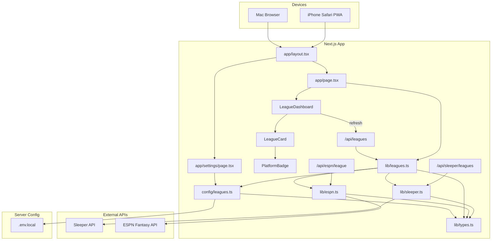
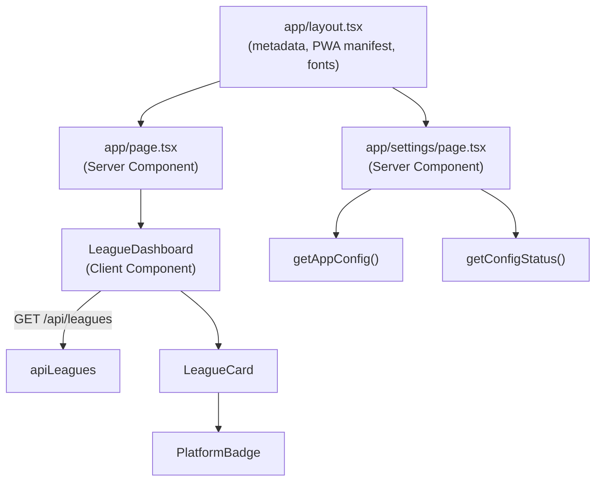
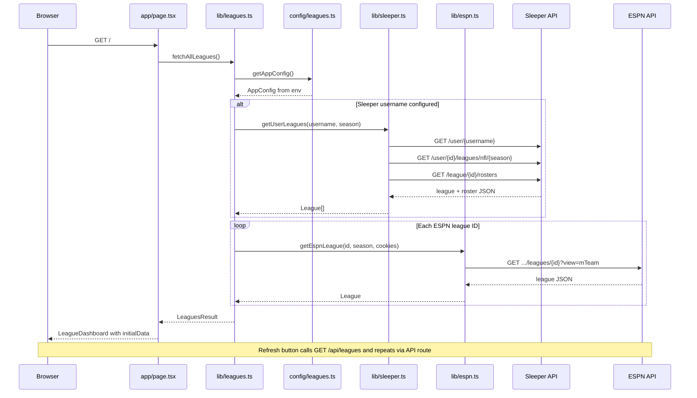
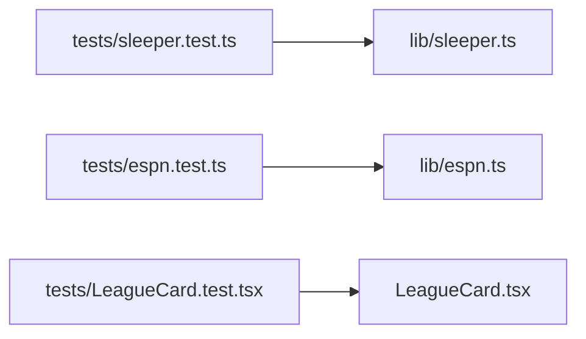

# C02Picks Architecture

Living diagram of how app components connect. **Update this file whenever you add, remove, or rewire modules.**

Last updated: 2026-05-30 (v1 — league dashboard MVP)

---

## System overview



---

## Page and component tree



---

## Data flow — dashboard load



---

## Module dependency map

| Module | Imports | Used by |
|--------|---------|---------|
| `lib/types.ts` | — | `sleeper`, `espn`, `leagues`, `config/leagues`, components |
| `config/leagues.ts` | `types` | `lib/leagues`, `settings/page`, `api/leagues` |
| `lib/sleeper.ts` | `types` | `lib/leagues`, `api/sleeper/leagues` |
| `lib/espn.ts` | `types` | `lib/leagues`, `api/espn/league` |
| `lib/leagues.ts` | `config`, `sleeper`, `espn`, `types` | `app/page`, `api/leagues` |
| `lib/dashboard-messages.ts` | `leagues` types | `LeagueDashboard` |
| `components/PlatformBadge.tsx` | `types` | `LeagueCard` |
| `components/LeagueCard.tsx` | `PlatformBadge`, `types` | `LeagueDashboard` |
| `components/LeagueDashboard.tsx` | `LeagueCard`, `leagues` types | `app/page` |
| `app/page.tsx` | `LeagueDashboard`, `leagues` | Next.js router |
| `app/settings/page.tsx` | `config/leagues` | Next.js router |
| `app/api/leagues/route.ts` | `lib/leagues` | HTTP clients, dashboard refresh |
| `app/api/sleeper/leagues/route.ts` | `lib/sleeper` | HTTP clients |
| `app/api/espn/league/route.ts` | `lib/espn` | HTTP clients |

---

## API routes

| Route | Handler | Purpose |
|-------|---------|---------|
| `GET /api/leagues` | `fetchAllLeagues()` | All configured Sleeper + ESPN leagues |
| `GET /api/sleeper/leagues?username=&season=` | `getUserLeagues()` | Sleeper leagues for one user |
| `GET /api/espn/league?leagueId=&season=` | `getEspnLeague()` | Single ESPN league |

---

## Tests



---

## File tree (source)

```
src/
├── app/
│   ├── layout.tsx
│   ├── page.tsx
│   ├── settings/page.tsx
│   └── api/
│       ├── leagues/route.ts
│       ├── sleeper/leagues/route.ts
│       └── espn/league/route.ts
├── components/
│   ├── LeagueDashboard.tsx
│   ├── LeagueCard.tsx
│   └── PlatformBadge.tsx
├── config/
│   └── leagues.ts
└── lib/
    ├── types.ts
    ├── sleeper.ts
    ├── espn.ts
    ├── leagues.ts
    └── dashboard-messages.ts
```

---

## Changelog

| Date | Change |
|------|--------|
| 2026-05-30 | Fix homepage hang: client-side league fetch, Sleeper API timeouts |
| 2026-05-30 | Env fix: Sleeper null-safe league fetch, dashboard empty-state messaging, `.env.local` guidance |
| 2026-05-30 | Initial v1: league dashboard, Sleeper + ESPN clients, PWA shell |
